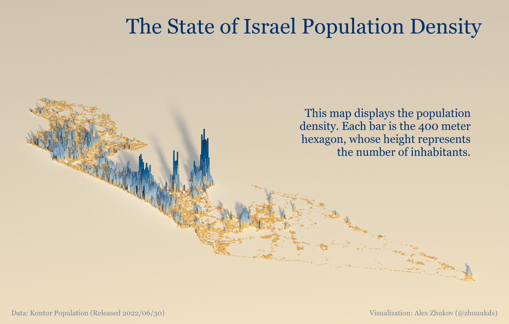

## Population Density of Israel

As someone who is passionate about data, I was motivated by Spencer Schien to create a map highlighting the population density of Israel. 
Using the `Kontur Inc.` population data, `R language`, and the `rayshader` library, I was able to produce this stunning visualization that brings the data to life.

#### Rendered Map from 3D
___

___
#### Many Thanks to:

- @Pecners for inspiration andtutorial 
- @tylermorganwall for `rayshader` and `rayrender` packages
- Kontur Inc. for an opportunity to use huge data of world population 
___

