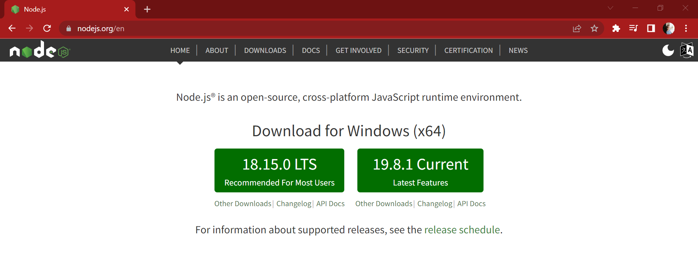
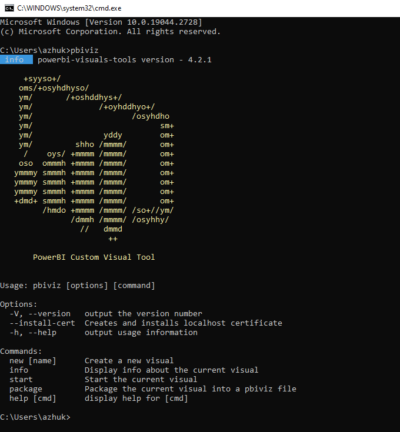
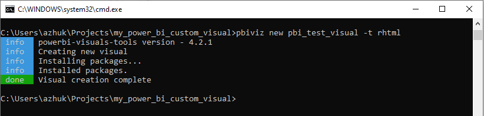
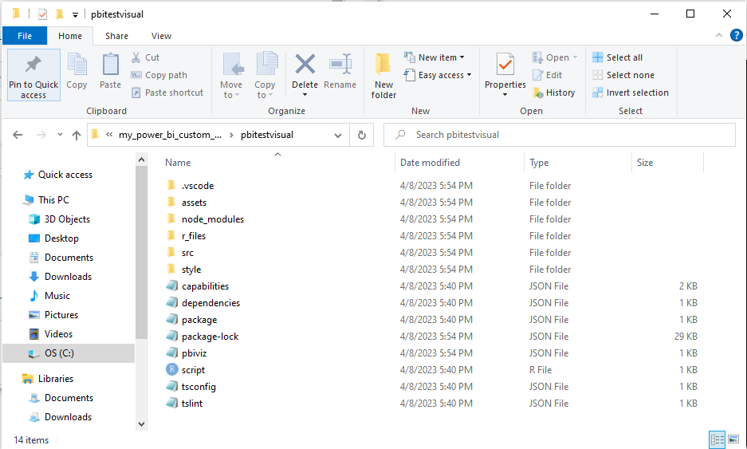
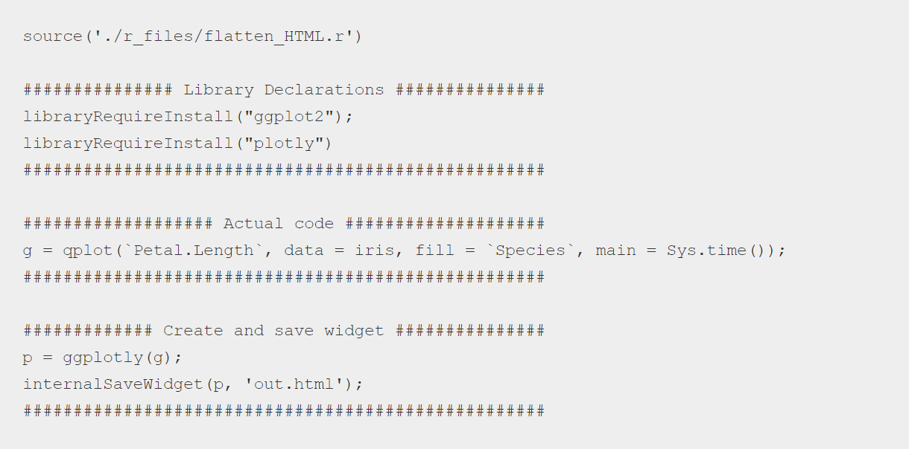
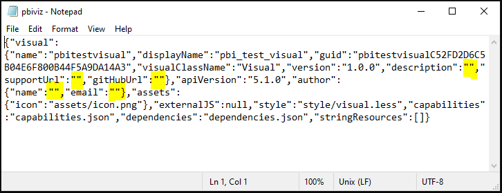
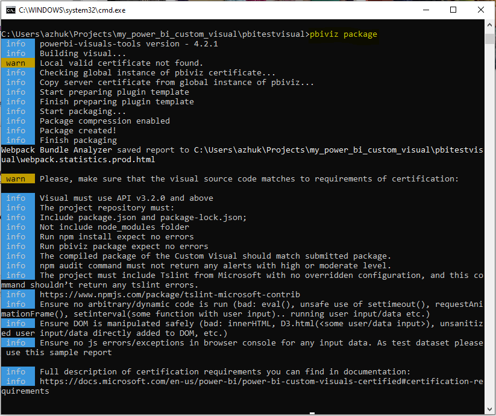
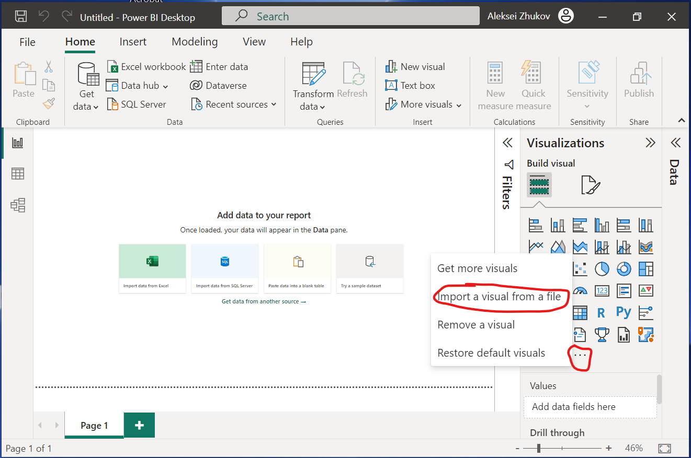
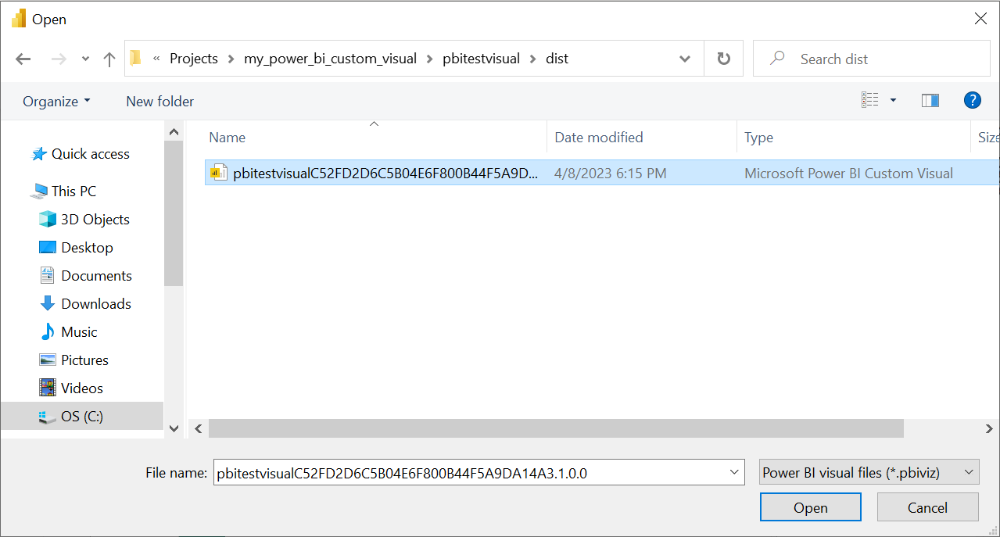
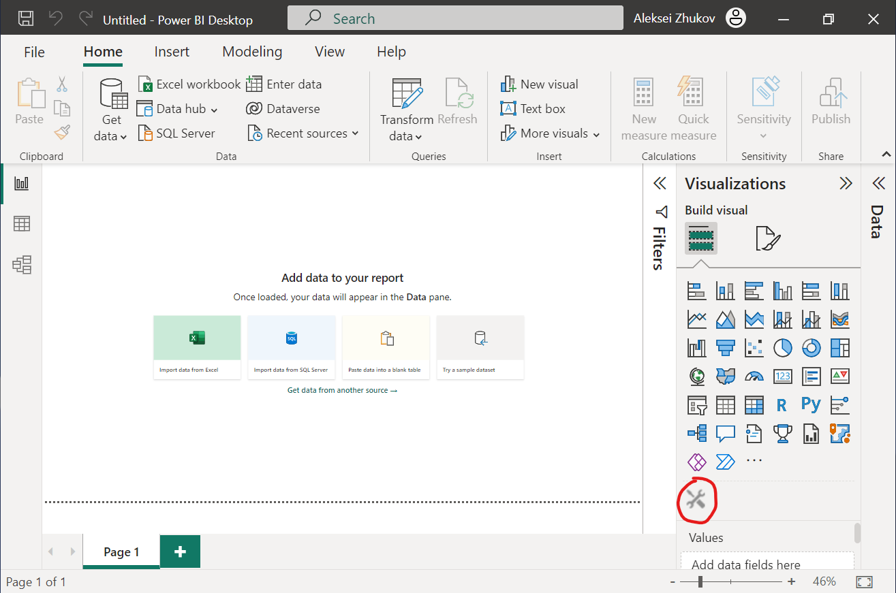

## Interactive Charts in Power BI

The possibility of coding in Python and R inside Power BI is truly amazing!

One can easily create Matplotlib, Seaborn, and ggplot2 visualizations just inside the PBI dashboard.

But what if we need a really interactive plot in our Power BI report? It becomes a bit trickier as there's no direct integration of the R Plotly package with Power BI at the moment.

However, I found a way to overcome this by creating a custom visual using the pbiviz tool. 
Now I can make my favorite interactive 3D scatter plots in Power BI in just a few clicks! 😊

#### A snapshot from my Power BI Desktop
___

### Here's a short tutorial how to create a custom Power BI visuals

1. Download from https://nodejs.org/ and install a `NodeJS` (don't be afraid, it's pretty simple 😊)

2. Install the `Power BI visual tools` - open Command Prompt (cmd) as admin user and type:

  <blockquote> npm install -g powerbi-visuals-tools </blockquote>
  
3. In order to check the correctness of installation, type `pbiviz` in cmd. If everthing is OK, then you see the following:

4. Now you can go to the project folder and create a new folder `pbi_test_visual` for a sample visual `rhtml` template typing the following in cmd:

<blockquote> pbiviz new pbi_test_visual -t rhtml </blockquote>

you'll see something like this:

5. This newly created folder consists of the multiple files/folders:

6. This is a folder that provides a template to create other R custom visuals, so check the file `script.r` inside the folder:

7. You should put the your `r` script inside the `Actual code` block. You can find my version [here](Plotly_in_PowerBI/script.r)

8. Before creating a package from the `r` script, you should fill in some info into `pbiviz.json` file in any  text editor:

8. Now you should type `pbiviz package` in cmd from the `pbitestvisual` folder. If everything is OK you'll see the following:

9. Finally load your new custom visual (`.pbiviz` file in `dist` folder) into the Power BI Desktop:

10. And after all these steps you'll have your own custom visual in your Power BI Desktop

