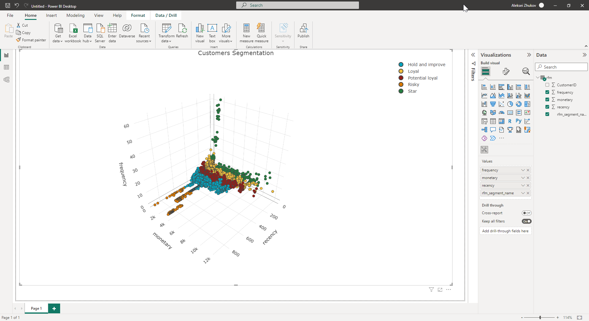

## Interactive Charts in Power BI

The possibility of coding in Python and R inside Power BI is truly amazing!

One can easily create Matplotlib, Seaborn, and ggplot2 visualizations just inside the PBI dashboard.

But what if we need a really interactive plot in our Power BI report? It becomes a bit trickier as there's no direct integration of the R Plotly package with Power BI at the moment.

However, I found a way to overcome this by creating a custom visual using the pbiviz tool. 
Now I can make my favorite interactive 3D scatter plots in Power BI in just a few clicks! 😊

#### A snapshot from my Power BI Desktop
___

