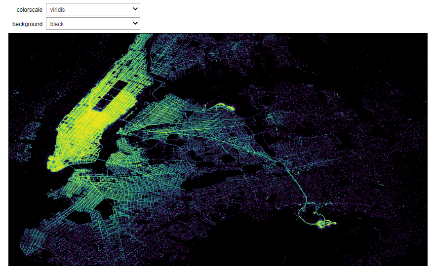

# The List of Stunning Data Visualizations

#### 1) Plot Millions of Recods on Map and Interactive Web App with `Datashader`, `Bokeh`, `Holoviews`, etc
The visualizations highlight the differences in taxi trip intensity depending on the day of the week and hour. I used tools like Holoviews, Plotly, Folium, and Datashader to create informative and visually appealing visualizations that showcase the patterns I identified.
In addition, I created a web app that allows interactively exploring the changing locations and intensity of taxi trips in New York City over time. The app can be used to filter by day of the week and hour and to see the trends.

#### 2) Interactive `Plotly` 3d Scatterplot in `Power BI`
I found a way how to integrate `plotly` made interactive charts inside Power BI dashboard.
I created a custom visual using the pbiviz tool. 
Now I can make my favorite interactive 3D scatter plots in Power BI in just a few clicks!

#### 3) Population Density in Israel with `R` and `rayshader`
As someone who is passionate about data, I was motivated by Spencer Schien to create a map highlighting the population density of Israel.  
Using the `Kontur Inc.` population data, `R language`, and the `rayshader` library, I was able to produce this stunning visualization that brings the data to life.

#### 4) COVID-19 Worldwide Vaccination Overview with `Tableau`  
It seems that data analytics is becoming an increasingly competitive and skill-demanding field. And it's not enough to know only one data visualization tool to stay on trend. So I decided to learn the intricacies of working with `Tableau`. 
Here is my first `Tableau` project - a `Covid-19` Vaccine Tracker that tracks how the vaccination is performing worldwide  

#### 5) Word Cloud From the Pandas DataFrame Using `Wordcloud`  
A word cloud is a data visualization technique that shows the most used words in large font and the least used words in small font. It helps to get an idea about the text data, especially when working on natural language processing or business insights. This notebook shows how to visualize a word cloud from a pandas DataFrame in Python.   

#### 6) Apple Stock Prices in Candle Stick Graph Using `Plotly`  
A candlestick chart is a data visualization tool used to analyze the price movements of stocks, cryptocurrencies, currencies, and other financial instruments. 

#### 7) Apple Stock Prices in Time Series Graph Using `Plotly`  
A time-series graph is a line plot used to visualize time series data. 

#### 8) Choropleth Map Using `Plotly`  
A choropleth map is a shaded map where the intensity of the colour indicates the intensity or quantity of a particular feature.  

#### 9) Data Visualization on Map with `Folium`  
This is a way to analyze geospatial data, when we plot the latitude and longitude data on a map. 

#### 10) Histogram and Density Plots with `Matplotlib` and `Selenium`  
Histogram and density plots are a good way to quickly visualize and analyze the distribution of the dataset. 

#### 11) Radar Plot with `Plotly`  
A radar plot is also known as a spider plot or a star plot. It is used to display multivariate data as a two-dimensional visualization of quantitative features that are represented on axes coming from the centre.  

