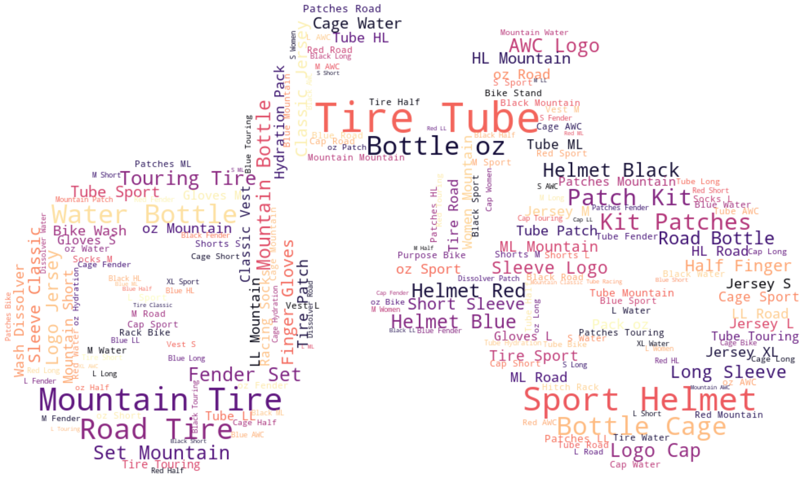

## Word Cloud from a Pandas DataFrame

A word cloud is a data visualization technique that shows the most used words in large font and the least used words in small font. It helps to get an idea about the text data, especially when working on natural language processing or business insights. This notebook shows how to visualize a word cloud from a pandas DataFrame in Python.

The idea of this project is to visualize the most common additional product names that people tend to buy together with the main product. The main sales product in our dataset is a Bike and related products are Clothing and Accessories.

This approach can be used to evaluate the basic insights for marketing strategies and campaigns.

